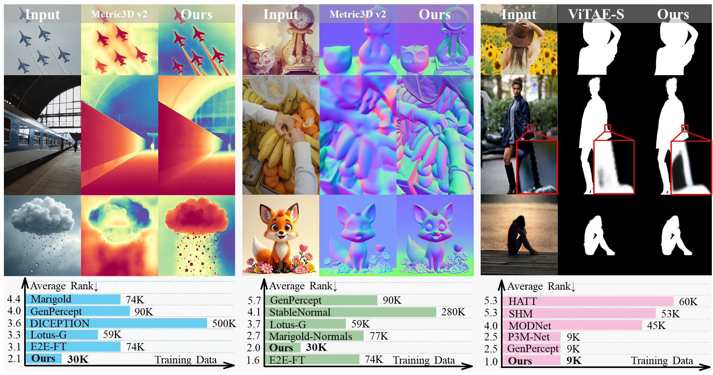
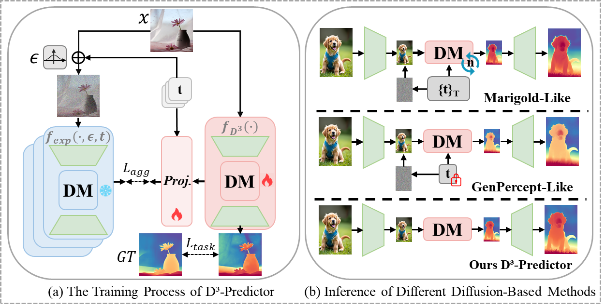

<h1 align="center">
D³-Predictor: Noise-Free Deterministic Diffusion for Dense Prediction
</h1>
<p align="center">
  <a href="https://x-gengroup.github.io/HomePage_D3-Predictor/"><b>[🌐 Website]</b></a> •
  <a href="https://arxiv.org/pdf/2512.07062"><b>[📜 Paper]</b></a> •
  <a href="https://huggingface.co/collections/X-GenGroup/d3-predictor-model"><b>[🤗 HF Models]</b></a> •  
  <a href="https://huggingface.co/collections/X-GenGroup/d3-predictor-data"><b>[🤗 HF Dataset]</b></a> •  
</p>


<p align="center">
Repo for "<a href="https://arxiv.org/pdf/2512.07062" target="_blank">D³-Predictor: Noise-Free Deterministic Diffusion for Dense Prediction</a>"
</p>



## D³-Predictor Model


##  News

- _2025.12_:  We release the <a href="https://huggingface.co/collections/X-GenGroup/d3-predictor-data"><b>[Training data]</b></a> .

- _2025.12_:  We release the checkpoints of the <a href="https://huggingface.co/collections/X-GenGroup/d3-predictor-model"><b>[D³-Predictor model]</b></a> .


## Installation
Create a virtual environment and install the required dependencies:
```bash
conda create -n d3_predictor python=3.10
conda activate d3_predictor
pip install -r requirements.txt
```

## Training
<!-- > 📌 For tasks in DenseWorld: -->
Please follow the steps below for training:
> - For the **depth estimation** task, use the code in ```D3-Predictor-Depth/```.
> - For the **surface normal estimation** task, use the code in ```D3-Predictor-Normal/```.
> - For the **image matting** task, use the code in ```D3-Predictor-Matting/```.

1. Make sure to set the correct paths in ```.yaml``` configs.
2. Specify the wandb API key before training.
3. Start training
```bash
bash launch_train_{depth/normal/matting}.sh
```

## Inference
1. Download checkpoints to ```checkpoints/{depth/normal/matting}```
2. Make sure to set the correct paths in ```inference_{depth/normal/matting}.py```.
3. Start inference
```bash
python D3-Predictor-{Depth/Normal/Matting}/inference_{depth/normal/matting}.py
```

## Acknowledgment
  Thanks to <a href="https://github.com/prs-eth/Marigold" target="_blank">Marigold</a> for data preprocessing and results evaluation support, <a href="https://huggingface.co/sd2-community/stable-diffusion-2-1" target="_blank">Stable Diffusion 2.1</a> and <a href="https://huggingface.co/black-forest-labs/FLUX.1-dev" target="_blank">FLUX.1-dev</a> for powerful pretrained model, and <a href="https://github.com/CompVis/cleandift" target="_blank">Cleandift</a> for their wonderful open-sourced work.

## Citation
If you find it helpful, please kindly cite the paper.
```
@misc{xia2025mathrmdmathrm3predictornoisefreedeterministicdiffusion,
      title={D³-Predictor: Noise-Free Deterministic Diffusion for Dense Prediction}, 
      author={Changliang Xia and Chengyou Jia and Minnan Luo and Zhuohang Dang and Xin Shen and Bowen Ping},
      year={2025},
      eprint={2512.07062},
      archivePrefix={arXiv},
      primaryClass={cs.CV},
      url={https://arxiv.org/abs/2512.07062}, 
}
```

## 📬 Contact

If you have any inquiries, suggestions, or wish to contact us for any reason, we warmly invite you to email us at 202066@stu.xjtu.edu.cn or cp3jia@stu.xjtu.edu.cn.